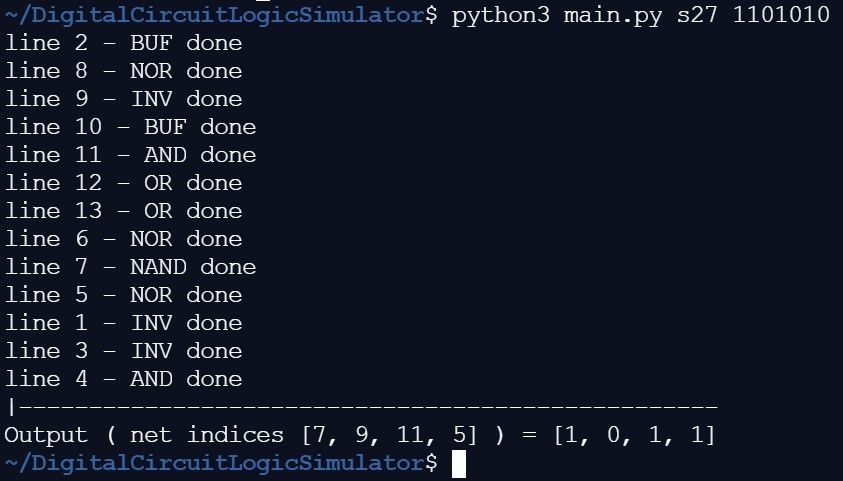

# Logic_Simulator  
Python based simulation of logic for digital logic circuits. Input the digital circuit in the standard text file form and provide the input vector to generate the corresponding output of the logic circuit

<h4> Dependencies: </h4> 
itertools

<h4> Usage: </h4>  
python3 main.py <circuit name> <input vector>  
Eg:- python3 main.py s27 1101010  
  Note that the digital circuit file should be placed in the same location as the script in the standart text file representation.
